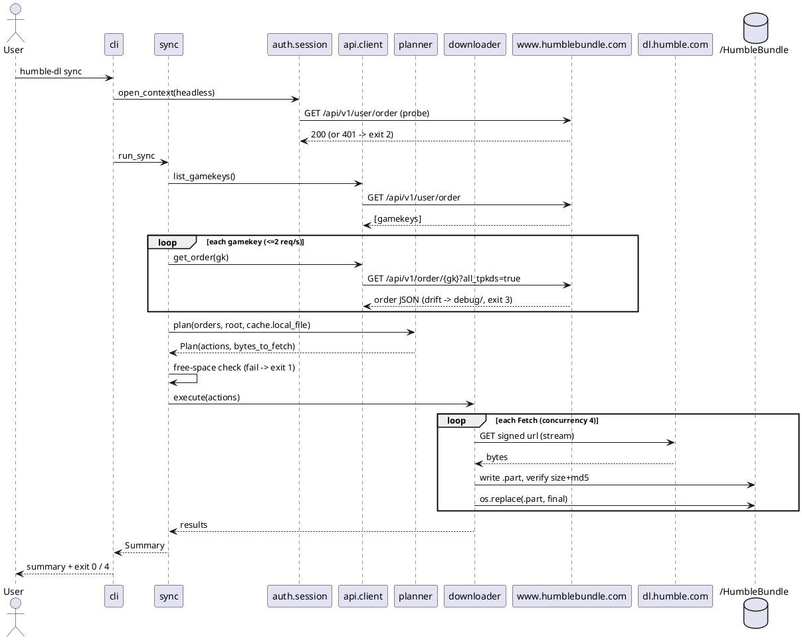
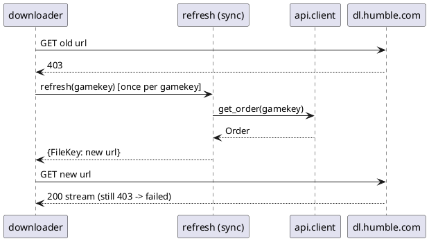
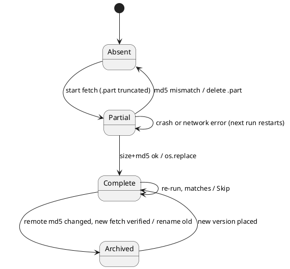

# Data flows (proposed)

## Sync (happy path + resume)

```plantuml
@startuml
actor User
participant cli
participant sync
participant "auth.session" as sess
participant "api.client" as client
participant planner
participant downloader
participant "www.humblebundle.com" as hb
participant "dl.humble.com" as cdn
database "~/HumbleBundle" as disk

User -> cli : humble-dl sync
cli -> sess : open_context(headless)
sess -> hb : GET /api/v1/user/order (probe)
hb --> sess : 200 (or 401 -> exit 2)
cli -> sync : run_sync
sync -> client : list_gamekeys()
client -> hb : GET /api/v1/user/order
hb --> client : [gamekeys]
loop each gamekey (<=2 req/s)
  sync -> client : get_order(gk)
  client -> hb : GET /api/v1/order/{gk}?all_tpkds=true
  hb --> client : order JSON (drift -> debug/, exit 3)
end
sync -> planner : plan(orders, root, cache.local_file)
planner --> sync : Plan(actions, bytes_to_fetch)
sync -> sync : free-space check (fail -> exit 1)
sync -> downloader : execute(actions)
loop each Fetch (concurrency 4)
  downloader -> cdn : GET signed url (stream)
  cdn --> downloader : bytes
  downloader -> disk : write .part, verify size+md5
  downloader -> disk : os.replace(.part, final)
end
downloader --> sync : results
sync --> cli : Summary
cli --> User : summary + exit 0 / 4
@enduml
```

## Expired signed URL

```plantuml
@startuml
participant downloader
participant "refresh (sync)" as refresh
participant "api.client" as client
participant "dl.humble.com" as cdn

downloader -> cdn : GET old url
cdn --> downloader : 403
downloader -> refresh : refresh(gamekey) [once per gamekey]
refresh -> client : get_order(gamekey)
client --> refresh : Order
refresh --> downloader : {FileKey: new url}
downloader -> cdn : GET new url
cdn --> downloader : 200 stream (still 403 -> failed)
@enduml
```

## File state machine (per target path)

```plantuml
@startuml
[*] --> Absent
Absent --> Partial : start fetch (.part truncated)
Partial --> Complete : size+md5 ok / os.replace
Partial --> Absent : md5 mismatch / delete .part
Partial --> Partial : crash or network error (next run restarts)
Complete --> Complete : re-run, matches / Skip
Complete --> Archived : remote md5 changed, new fetch verified / rename old
Archived --> Complete : new version placed
@enduml
```
